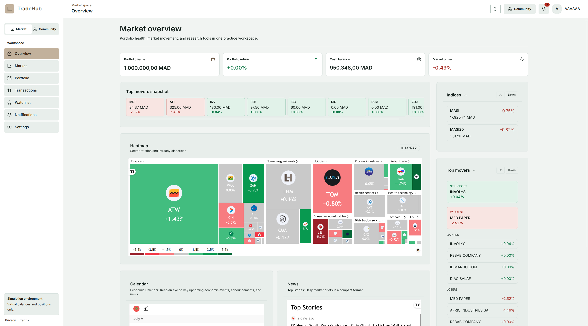
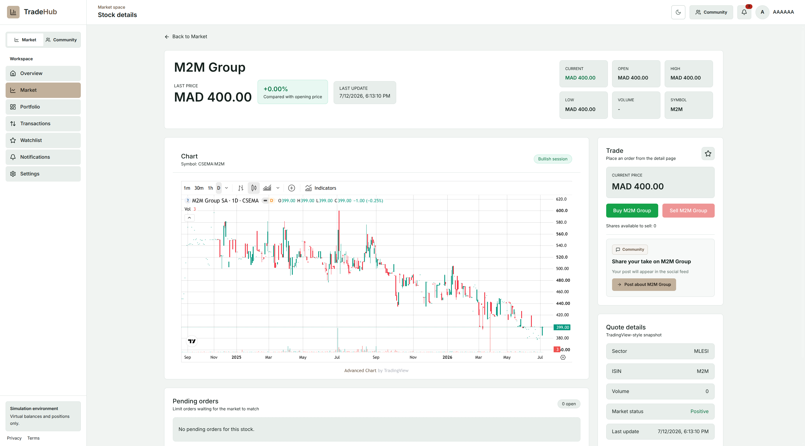
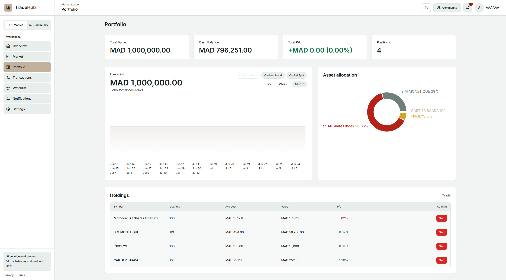
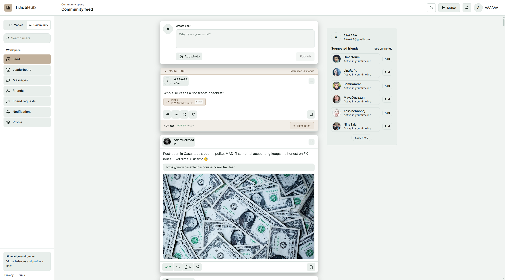

<h1>TradeHub</h1>

<h3>A unified investing experience for Morocco's retail investors</h3>

<strong>Market intelligence · Virtual trading · Portfolio insight · Investor community</strong>

TradeHub brings the essential parts of the investing journey into one focused platform—helping users understand the market, practise investment decisions, follow their performance, and connect with other investors.

> **Public product showcase**  
> TradeHub is a proprietary project. Its source code and internal implementation are maintained privately.

## The product

Moroccan retail investors often move between separate market websites, spreadsheets, virtual-investing tools, news sources, and informal discussion groups. That fragmented experience makes it harder to move confidently from research to action and from action to learning.

TradeHub brings that journey together in a functional fintech platform built around the Moroccan market:

- **Discover** listed instruments, market movements, indices, analytics, and financial news.
- **Practise** investment decisions with virtual capital and realistic portfolio tracking.
- **Understand** holdings, allocation, cash, profit and loss, and performance over time.
- **Connect** through posts, reactions, comments, following, messaging, and community rankings.

## My engineering contribution

I was responsible for the backend and operational engineering behind TradeHub—from the APIs and financial domain logic to the environment used to run, monitor, and route the platform.

| Area | What I designed and built |
|---|---|
| **Backend APIs** | RESTful APIs with NestJS for authentication, virtual trading, portfolio management, market features, and social interactions. |
| **Real-time functionality** | A WebSocket communication layer supporting live platform interactions, messaging, and notifications. |
| **Financial engine** | Core portfolio and trading logic, including PnL calculations, portfolio tracking, order processing, and risk constraints. |
| **Authentication and access** | Secure JWT-based authentication and protected access to user and platform resources. |
| **Market-data processing** | Event-driven workers for automated market-data ingestion and scheduled processing. |
| **Database engineering** | A structured PostgreSQL data layer managed with Prisma ORM for the platform's financial, user, and social domains. |
| **Monitoring and incident visibility** | Prometheus metrics, Grafana dashboards, and Loki log aggregation for service monitoring and incident investigation. |
| **Containerized delivery** | A reproducible multi-service environment using Docker and Docker Compose, Kubernetes. |
| **Deployment routing** | A production-like Nginx reverse-proxy setup for traffic routing and service exposure, VPS setup, CICD. |

**Core technologies:** NestJS · TypeScript · PostgreSQL · Prisma ORM · WebSockets · JWT · Docker · Docker Compose · Nginx · Prometheus · Grafana · Loki

## Product experience

<table>
  <tr>
    <td width="50%" valign="top">
      
        
      <strong>Market overview</strong> 
      A focused view of market movement, key indicators, active instruments, events, and relevant financial news.
    </td>
    <td width="50%" valign="top">
      
        
      <strong>Research and virtual trading</strong> 
      Company context, price history, trading data, and virtual buy or sell decisions in the same workspace.
    </td>
  </tr>
  <tr>
    <td width="50%" valign="top">
      
        
      <strong>Portfolio insight</strong> 
      Virtual cash, total value, profit and loss, allocation, performance, positions, and individual holdings at a glance.
    </td>
    <td width="50%" valign="top">
      
        
      <strong>Community</strong> 
      A dedicated space to publish market ideas, react, comment, follow investors, exchange messages, and compare progress.
    </td>
  </tr>
</table>

## What TradeHub demonstrates to clients

- Building complete, domain-driven backend systems—not only basic CRUD APIs.
- Translating financial product requirements into secure trading and portfolio logic.
- Combining REST APIs and real-time communication in one coherent product experience.
- Automating data processing and operating database-backed services reliably.
- Packaging, routing, monitoring, and preparing a multi-service platform for deployment.

## Work with me

I help clients build and improve **backend platforms, APIs, real-time systems, data-driven products, automation, containerized infrastructure, monitoring, and deployments**.

If you are building a technical product or need help making an existing system more reliable, [contact me through GitHub](https://github.com/Nour-Eddin-01).
